 
# Aman Shop

A peer-to-peer shopping app built using Jetpack Compose, open-sourced for contribution and learning purposes. The app focuses on UI implementation and provides a foundation for future logic development.

This shopping app's UI is created for demonstration and practice and is not connected to any API. All its resources are defined within the app or saved locally.

The app was created to enhance Jetpack Compose skills and serve as a foundation for future projects. It is open-source to gather recommendations and receive contributions to improve the UI and overall structure.

**Note**: All listed features are implemented as UI only; logic implementations are not included. The app includes some non-functional endpoints (e.g., selling, user registration) for demonstration purposes. Contributions are welcome, as the app is still in early development.

## Screenshots
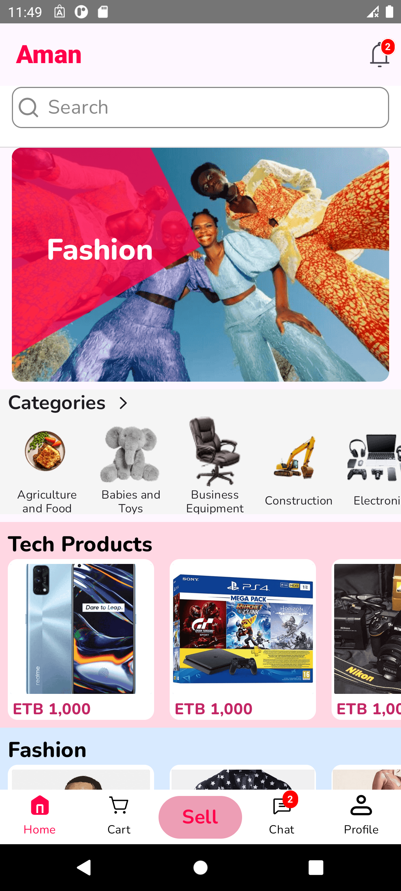 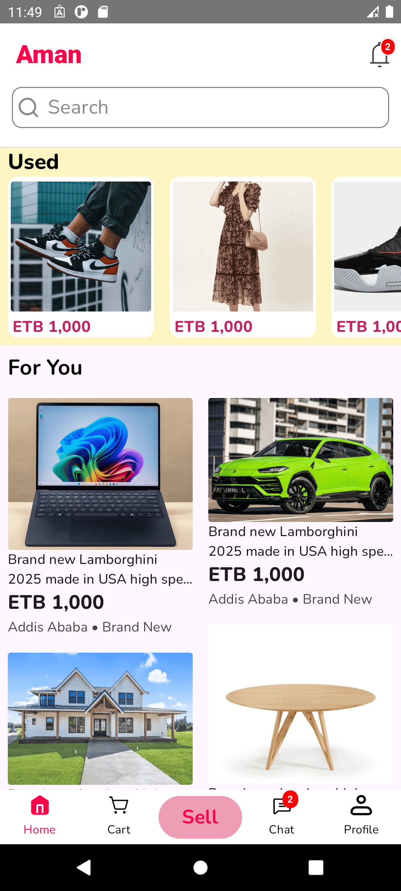&nbsp;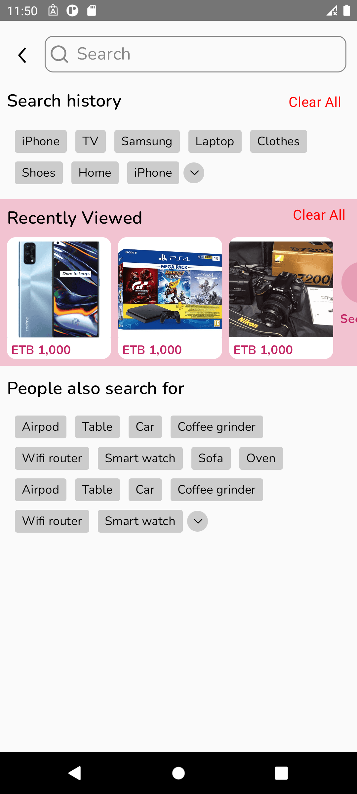 

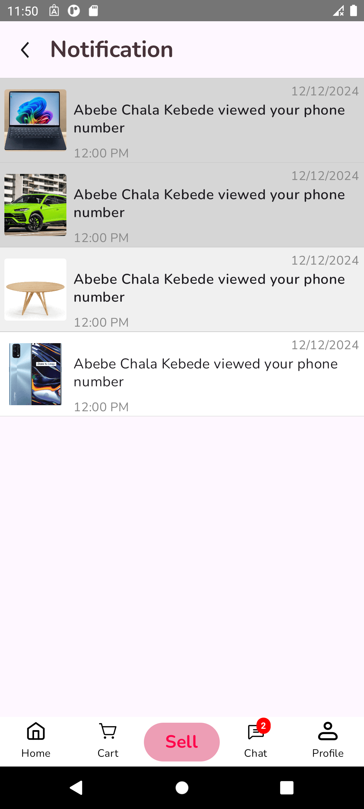 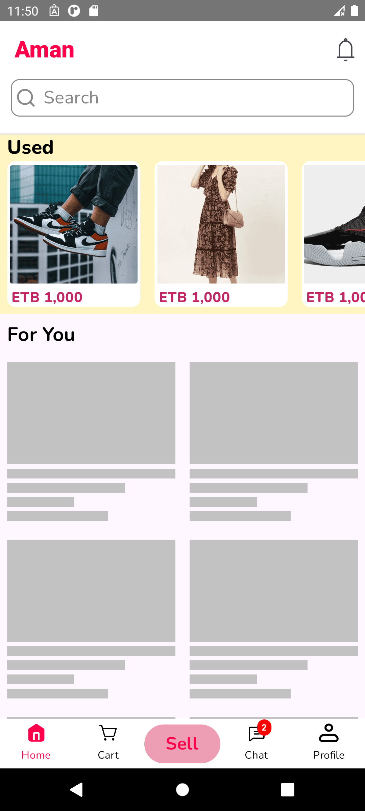 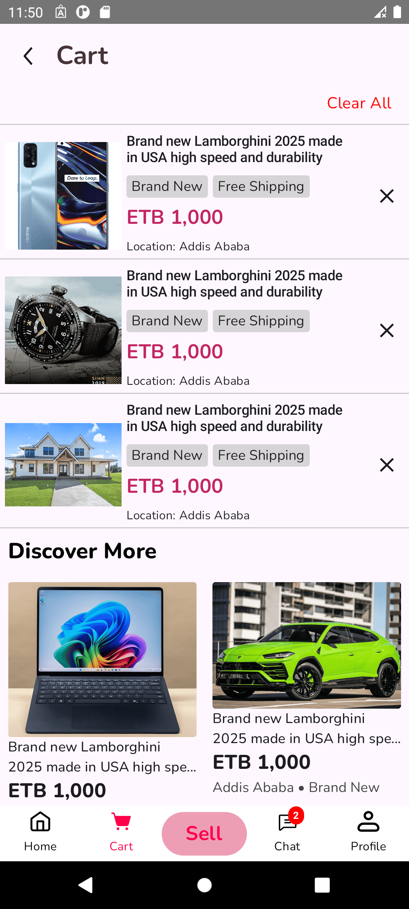 

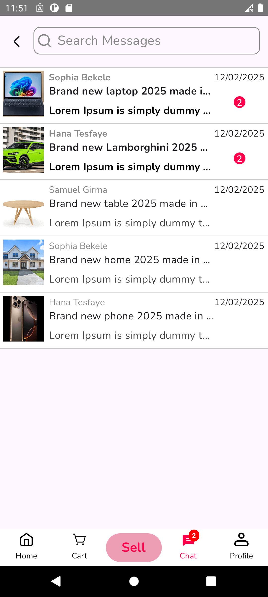 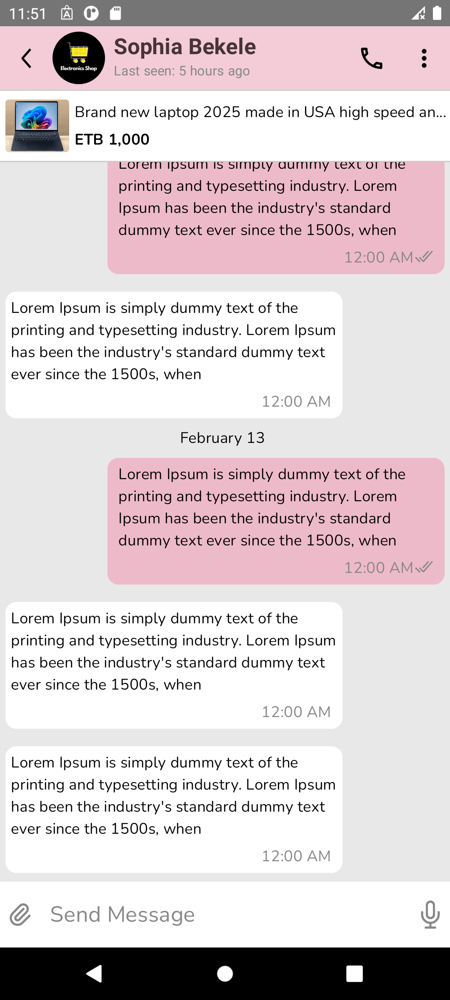 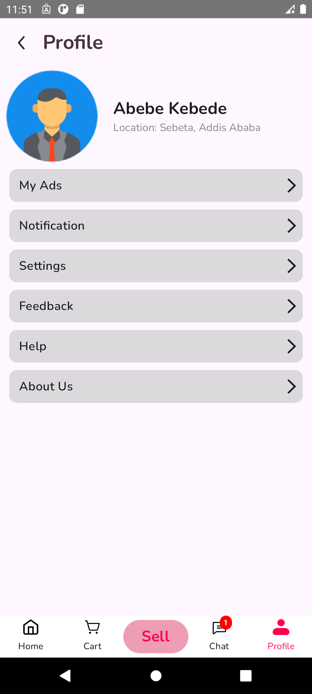 

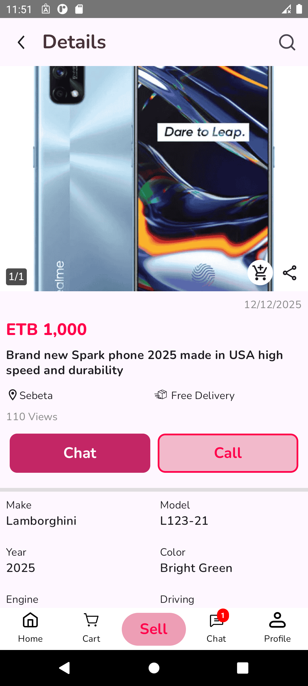 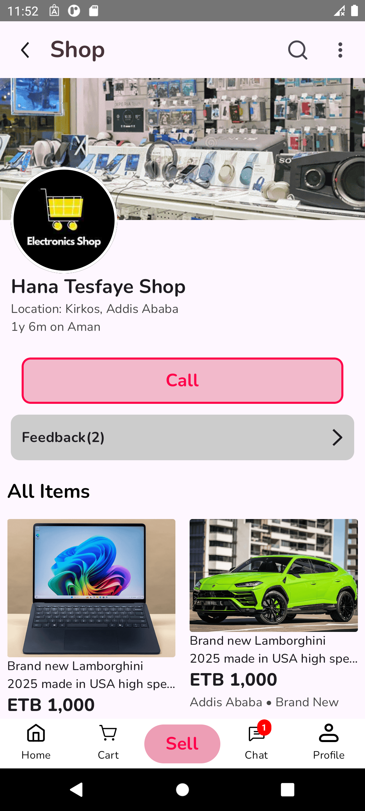 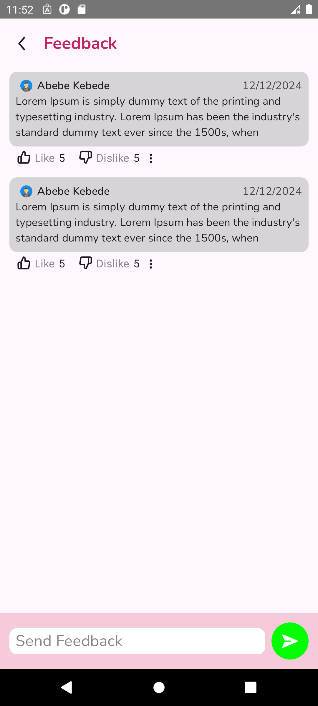 

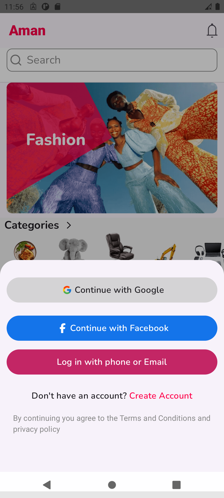 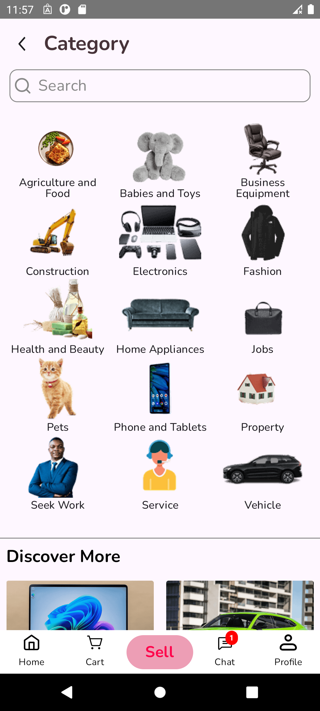 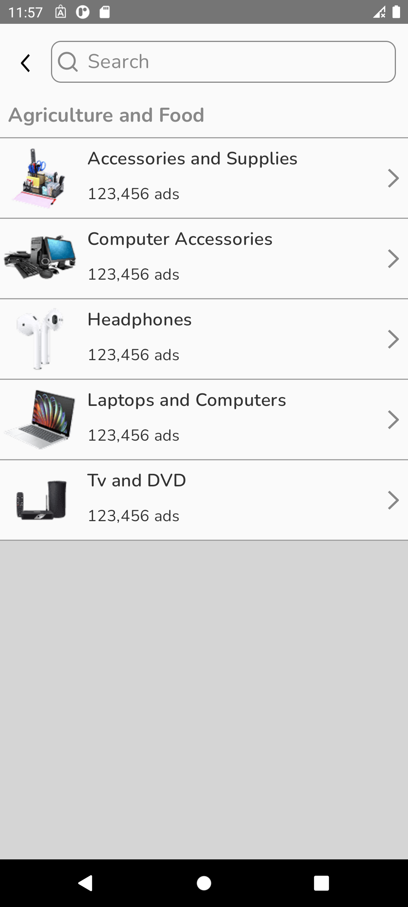 

## Features

The app includes the following UI screens:

* User chat and negotiation for products.
* Cart management (adding, viewing items).
* Seller performance tracking (product views).
* Buyer feedback and seller reporting.
* Google and Facebook login integration (UI).
* Notify users on Message and necessary events (viewed phone number, sent call me back ...)
* Filter the searched products based on brand, category and etc.

## Usage

The app provides a UI for peer-to-peer shopping. Users can browse items, chat with sellers, manage a cart, and view seller performance.

## Used Tech Stacks

-   [Kotlin](https://developer.android.com/kotlin)  - Kotlin is a programming language that can run on JVM. Google has announced Kotlin as one of its officially supported programming languages in Android Studio; and the Android community is migrating at a pace from Java to Kotlin.
* Clean Architecture - A software architecture pattern that aims to achieve separation of concerns by dividing the software into conceptual layers.

* [Kotlinx Serialization - JSON](https://github.com/Kotlin/kotlinx.serialization) - Allows for easy serialization and deserialization of Kotlin objects to and from JSON format.

* [Android Core - Splash Screen](https://developer.android.com/develop/ui/views/launch/splash-screen) - Provides a standard way to implement splash screens in Android apps.

* [Android Jetpack Compose - Material Icons Extended](https://developer.android.com/jetpack/compose/material) - Provides a set of extended icons that follow the Material Design guidelines.
    
-   Jetpack components:
    
    -   [Jetpack Compose](https://developer.android.com/jetpack/compose)  - Jetpack Compose is Android’s modern toolkit for building native UI. It simplifies and accelerates UI development on Android. Quickly bring your app to life with less code, powerful tools, and intuitive Kotlin APIs.
    -   [Android KTX](https://developer.android.com/kotlin/ktx.html)  - Android KTX is a set of Kotlin extensions that are included with Android Jetpack and other Android libraries. KTX extensions provide concise, idiomatic Kotlin to Jetpack, Android platform, and other APIs.
    -   [AndroidX](https://developer.android.com/jetpack/androidx)  - Major improvement to the original Android  [Support Library](https://developer.android.com/topic/libraries/support-library/index), which is no longer maintained.
    -   [Lifecycle](https://developer.android.com/topic/libraries/architecture/lifecycle)  - Lifecycle-aware components perform actions in response to a change in the lifecycle status of another component, such as activities and fragments. These components help you produce better-organized, and often lighter-weight code, that is easier to maintain.
    -   [ViewModel](https://developer.android.com/topic/libraries/architecture/viewmodel)  -The ViewModel class is designed to store and manage UI-related data in a lifecycle conscious way.
    -  [Android Jetpack Adaptive](https://developer.android.com/jetpack/androidx/releases/adaptive) - Provides tools for building adaptive UIs that respond to different screen sizes and device configurations
    -   [Android Jetpack Lifecycle - ViewModel Compose](https://developer.android.com/jetpack/androidx/releases/lifecycle) - Facilitates the management of UI-related data in a lifecycle-conscious way, surviving configuration changes.
    - [Android Jetpack Navigation - Compose](https://developer.android.com/jetpack/androidx/releases/navigation) - Enables navigation between composables within your app.

-   [Kotlin Coroutines](https://developer.android.com/kotlin/coroutines)  - A concurrency design pattern that you can use on Android to simplify code that executes asynchronously.           

## License

This project is licensed under the Apache 2.0 License.

## Contact

* Telegram: [https://t.me/proaman777](https://t.me/proaman777)
* Email: amanuyosi12@gmail.com
